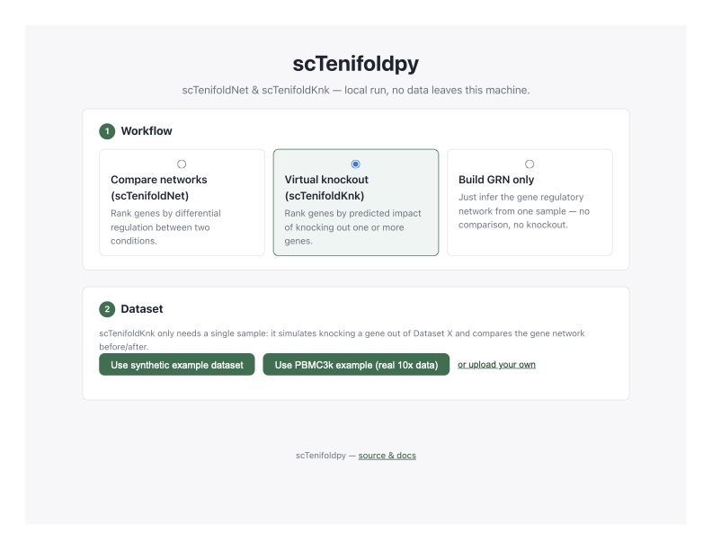

# scTenifoldpy

[](https://github.com/qwerty239qwe/scTenifoldpy/actions/workflows/ci.yml)
[](https://codecov.io/gh/qwerty239qwe/scTenifoldpy)
[](https://pypi.org/project/scTenifoldpy/)
[](https://pypi.org/project/scTenifoldpy/)
[](LICENSE)
[](https://www.sciencedirect.com/science/article/pii/S2666389920301872)

`scTenifoldpy` is a Python implementation of the scTenifold suite: **scTenifoldNet** (cross-condition GRN comparison), **scTenifoldKnk** (virtual knockout), and **scTenifoldXct** (cell-cell interaction prediction, provided via the separately maintained `scTenifoldXct` package).

## Local Web UI

Run scTenifoldNet, scTenifoldKnk, or plain GRN construction from a browser instead of code:

```bash
pip install "scTenifoldpy[ui]"
sctenifold-ui
```



This opens a local page (`http://127.0.0.1:8000`) where you can try a
bundled synthetic dataset or the real 10x PBMC3k dataset (the one behind
the Seurat/Scanpy tutorials), or upload your own data as a genes-by-cells
CSV or an AnnData `.h5ad` file. Pick a workflow, run it, and download the
ranked-gene or ranked-edge results as CSV. Everything runs locally; no
data leaves your machine. See [the UI guide](docs/ui.md) for details.

## Installation

```bash
uv venv
uv add scTenifoldpy
```

or:

```bash
pip install scTenifoldpy
```

Optional extras:

```bash
# use uv
uv venv
uv add "scTenifoldpy[scanpy]"
uv add "scTenifoldpy[parallel-ray]"
uv add "scTenifoldpy[ui]"

# or use pip
pip install "scTenifoldpy[scanpy]"
pip install "scTenifoldpy[parallel-ray]"
pip install "scTenifoldpy[ui]"
```

The `scTenifoldXct` cell-cell interaction workflow is shipped as a
separately maintained dependency behind the `xct` extra (pulls PyTorch
and scanpy; requires Python >= 3.10):

```bash
pip install "scTenifoldpy[xct]"
```


## Docker

Build the default runtime image:

```bash
docker build -t sctenifoldpy .
```

Run the CLI from the container, mounting the current directory as the working directory:

```bash
docker run --rm -v "$PWD:/workspace" sctenifoldpy scTenifold --help
```

PowerShell:

```powershell
docker run --rm -v "${PWD}:/workspace" sctenifoldpy scTenifold --help
```

Optional extras can be included at build time:

```bash
docker build --build-arg EXTRAS=scanpy -t sctenifoldpy:scanpy .
docker build --build-arg EXTRAS=parallel-ray -t sctenifoldpy:ray .
```

## Class API

```python
from scTenifold.data import get_test_df
from scTenifold import scTenifoldNet

df_1 = get_test_df(n_cells=1000)
df_2 = get_test_df(n_cells=1000)

sc = scTenifoldNet(
    df_1,
    df_2,
    "X",
    "Y",
    qc_kws={"min_lib_size": 10},
    nc_kws={"backend": "serial", "n_jobs": 1},
)
result = sc.build()
```

## High-Level API

```python
from scTenifold import compare_networks, virtual_knockout

result = compare_networks(
    df_1,
    df_2,
    qc_kws={"min_lib_size": 10, "plot": False},
    network_kws={"n_nets": 3, "n_samp_cells": 100},
    backend="joblib-threading",
    n_jobs=4,
)

knockout = virtual_knockout(
    df_1,
    ko_genes=["NG-1"],
    qc_kws={"min_lib_size": 10, "min_percent": 0.001},
)
```

## Cell-Cell Interaction (scTenifoldXct)

`scTenifoldXct` is maintained separately
([cailab-tamu/scTenifoldXct](https://github.com/cailab-tamu/scTenifoldXct))
and re-exported here for convenience — `from scTenifold import
scTenifoldXct` returns the exact same class and results:

```python
import scanpy as sc
from scTenifold import scTenifoldXct

adata = sc.read_h5ad("log_normalised.h5ad")
xct = scTenifoldXct(
    data=adata,
    source_celltype="cell_A",
    target_celltype="cell_B",
    obs_label="ident",
    rebuild_GRN=True,
    GRN_file_dir="./xct_results",
)
xct.get_embeds(train=True)
enriched = xct.chi2_test()
```

See [the scTenifoldXct guide](docs/xct.md) for the CLI and differential
(two-sample) analysis. Requires `scTenifoldpy[xct]`.

## Parallel Backends

Network construction defaults to deterministic serial execution:

```python
from scTenifold import make_networks

networks = make_networks(df_1, backend="serial", n_jobs=1)
networks = make_networks(df_1, backend="joblib-loky", n_jobs=4)
```

Supported backends are `serial`, `joblib-loky`, `joblib-threading`, and `ray`. Ray is optional and requires `scTenifoldpy[parallel-ray]`.

## CLI

```bash
scTenifold config -t 1 -p ./net_config.yml
scTenifold net -c ./net_config.yml -o ./output_folder
scTenifold knk -c ./knk_config.yml -o ./output_folder
scTenifold xct data.h5ad -s cell_A -r cell_B -l ident   # needs [xct]
```

## Citation

If you use `scTenifoldpy` in scientific work, please cite this software
using the metadata in [`CITATION.cff`](CITATION.cff), and cite the
underlying method paper that matches your analysis:

**scTenifoldNet**

Osorio, D., Zhong, Y., Li, G., Huang, J. Z., & Cai, J. J. (2020).
scTenifoldNet: A machine learning workflow for constructing and comparing
transcriptome-wide gene regulatory networks from single-cell data.
*Patterns*, 1(9), Article 100139.
https://doi.org/10.1016/j.patter.2020.100139

**scTenifoldKnk**

Osorio, D., Zhong, Y., Li, G., Xu, Q., Yang, Y., Tian, Y., Chapkin, R. S.,
Huang, J. Z., & Cai, J. J. (2022). scTenifoldKnk: An efficient virtual
knockout tool for gene function predictions via single-cell gene regulatory
network perturbation. *Patterns*, 3(3), Article 100434.
https://doi.org/10.1016/j.patter.2022.100434

**scTenifoldXct**

Yang, Y., Osorio, D., Long, W., Bai, M., Wang, F., Yan, X., Yang, S.,
Chen, A., Zhang, P., Cai, J. J. (2023). scTenifoldXct: A semi-supervised
method for predicting cell-cell interactions and mapping cellular
communication graphs. *Cell Systems*, 14(4), 302-311.
https://doi.org/10.1016/j.cels.2023.01.004
